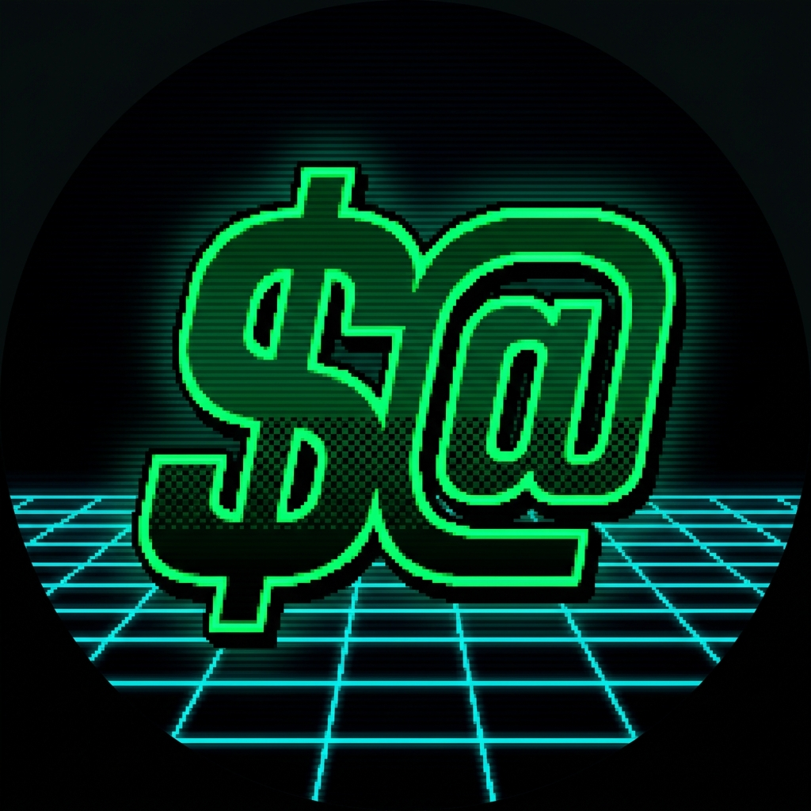
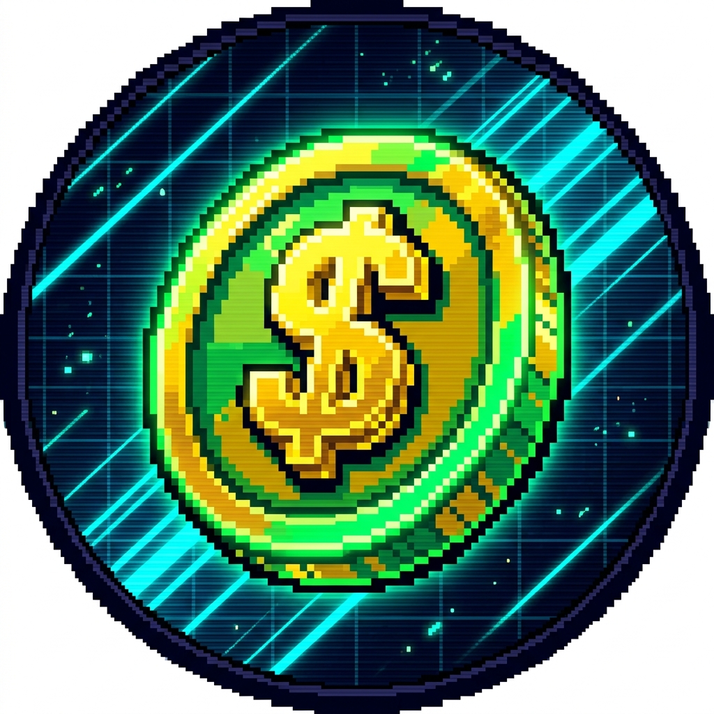

# Концепция бренда «На Балансе» (Ретро-киберпанк / Sega 16-bit)

Этот документ представляет детальный визуальный стиль, логотипы, шрифтовые пары, цветовую палитру и элементы интерфейса для B2B SaaS MVP финансового ИИ-ассистента **«На Балансе»**. Стиль вдохновлен 16-битной эпохой Sega Mega Drive и эстетикой ретро-киберпанка.

---

## 1. Обновление концепта на основе фидбека

На основе обратной связи от клиента мы отказались от чисто векторного SVG-логотипа в пользу **высококачественной растровой графики, сгенерированной с помощью ИИ (Imagen/Midjourney/DALL-E 3)**. Это позволило уйти от «топорных» векторных линий к богатым текстурам, правильному неоновому свечению, настоящему дизерингу (dithering) и CRT-эффекту старого телевизора, воссоздавая ту самую атмосферу 16-битных игр Sega Mega Drive.

### Метафорические решения:
1. **Гибрид $ и @**: Слияние символа финансов и адреса Telegram в единый динамичный пиксельный глиф.
2. **Ретро-монетка Sega ($)**: Альтернативное решение с объемной 3D-монеткой в стиле Sega-аркад, гарантирующее идеальное отображение без визуальной каши.

---

## 2. Сгенерированные ИИ аватарки (High-Res PNG)

Мы сгенерировали два качественных варианта аватарок и сохранили их в папку проекта `/assets/branding/`.

````carousel

<!-- slide -->

````

### Описание вариантов и ссылки на файлы:

1. **[Вариант 1: Кибер-гибрид $@](./retro_hybrid_avatar.png)**
   * **Суть**: В центре находится яркий неоново-зеленый глиф, объединяющий знак доллара ($) и спираль «собачки» (@). 
   * **Детали**: Наклонный динамичный силуэт с шахматным пиксельным заполнением (dithering), ярким свечением (neon glow) на абсолютно черном фоне с бирюзовой перспективной кибер-сеткой.
   * **Промпт для Midjourney/DALL-E 3**:
     > `A high-quality circular Telegram avatar of a retro-cyberpunk style Sega 16-bit financial icon. The icon features a digital neon-green symbol that seamlessly merges the dollar sign '$' and the 'at' sign '@' into a single dynamic, slanted blocky glyph. The symbol has a bright glowing neon lime green (#00FF66) outline and deep forest green inner gradients with a subtle checkerboard dithering pattern for a 16-bit arcade volume. The background is pitch black with a glowing cyan cyber grid perspective and faint horizontal CRT scanline texture, capturing the aesthetic of 90s Sega Genesis start screens, clean pixel art, vibrant cyber-neon contrast, centered composition.`

2. **[Вариант 2: Ретро-монетка Sega ($)](./retro_coin_avatar.png)**
   * **Суть**: Более чистый и считываемый образ. Золотая монета с зеленым отливом и объемным знаком доллара ($) в центре.
   * **Детали**: Текстура пикселей с резкими краями (aliased look), диагональные неоновые линии скорости (speedlines) на фоне, имитирующие загрузочные экраны Sega-картриджей. Выглядит аккуратно и дорого.
   * **Промпт для Midjourney/DALL-E 3**:
     > `A high-quality circular Telegram avatar of a retro 16-bit arcade style financial gold-and-green coin. In the center of the coin, there is a bold, pixelated dollar sign '$' extruded in 3D. The coin is slanted and has glowing neon green (#00FF66) and gold-yellow highlights. The background is a dark tech grid with diagonal neon cyan speedlines, creating a dynamic retro-future chiptune arcade vibe. Pixel art style, clean aliased edges, CRT scanlines, Sega Mega Drive game asset aesthetic, centered close-up icon.`

---

## 3. Визуальный гайдлайн для интерфейсов (UI/UX)

Чтобы стиль ретро-киберпанка выглядел премиально в B2B SaaS продукте, необходимо строго дозировать декоративные элементы.

### А. Цветовая палитра (Color Palette)

* **Background (Основной)**: `#020804` (глубокий черный с зеленым оттенком) — снижает нагрузку на глаза.
* **Surface (Панели, карточки)**: `#0A1C10` (темный лесной зеленый с прозрачностью) — создает эффект стекла.
* **Primary (Текст, ключевые элементы)**: `#00FF66` (неоновый лайм) — привлекает внимание.
* **Secondary (Акценты, ИИ)**: `#00F0FF` (кибер-бирюзовый) — для графиков и статусов.
* **Danger/Alert**: `#FF2A6D` (неоновый розовый) — для критических уведомлений.

### Б. Шрифты (Typography)

1. **Заголовки и HUD (Аркадный стиль)**:
   * **Шрифт**: **Press Start 2P** (Google Fonts).
   * **Применение**: Только для логотипа, баланса (крупные цифры) и редких плашек-акцентов.
2. **Данные и Цифры (Моноширинный стиль)**:
   * **Шрифт**: **JetBrains Mono** или **Fira Code**.
   * **Применение**: Списки транзакций, таблицы, аналитические графики (чтобы цифры не прыгали при обновлении).
3. **Основной читаемый текст (Гротеск)**:
   * **Шрифт**: **Inter** или **Plus Jakarta Sans**.
   * **Применение**: Текст подсказок, меню настроек, документация (обеспечивает высокую скорость чтения, критичную для B2B).

### В. Ключевые приемы современного ретро-стиля (WOW-эффект):
* **Стекломорфизм (Glassmorphism)**: Полупрозрачные карточки с размытием фона (`backdrop-filter: blur(12px)`) и тонкой неоновой обводкой в `1px` с прозрачностью 20%.
* **Акцентные HUD-рамки**: Вместо сплошных обводок используйте только уголки рамок (Target Brackets) на важных блоках.
* **Ретро-загрузчики**: Анимированные пиксельные прогресс-бары в стиле загрузки Sega-картриджей для ИИ-анализа.
